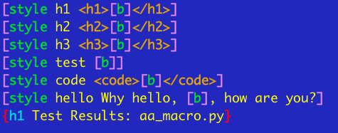

# [aa\_macro.py](aa_macro.py) -- class macro()

> Also see: [project file descriptions](files.md)



I don't particularly appreciate WYSIWYG HTML/CSS editors, as they may
generate sub-par code, may break with any application or library or
operating system upgrade, and in the end, I have zero control over where
and when they break, or any particular assurance I can easily correct
the problem\(s\) if and when they occur. So something to make generation
of HTML and CSS easier, of which I had direct control... and which
depended upon nothing outside of Python itself... that really seemed
like a fine idea to me. And so class `macro()` was born. :\)

This project provides a means for me, and anyone else who wants to, to
generate HTML or other types of text documents using Python as the
intermediary engine. There are no external dependencies that aren't
actually part of the latest Python 2-series distribution. \(This is
*not* a Python-3 project. Fork and modify if you need that.\)

Consequently the class is relatively lightweight and trivially installed
&mdash; just drop the `aa_macro.py` file in and you're done. You'll
probably want the [aagen utility](aagen) as well if you're looking to
just make documents, but you don't need it if you're going to be using
the class directly in your own Python applications; [aagen](aagen) is
basically just a command-line friendly wrapper around the class.

> Don't be intimidated by the number of files in the repo; everything
except [aa_macro.py](aa_macro.py) is either documentation, sample files,
part of the unit tests, or related to a markdown-to-macro
format converter utility.

The benefit is conceptually like markdown &mdash; just feed in a text file
and get back HTML &mdash; but `macro()` is much, much
more powerful. 

`macro()` is a terrific solution to a very wide range of HTML formatting
tasks and challenges. You can do anything from format a simple paragraph
to generate a complete manual with indexes, table of contents,
footnotes, completely custom styles and more.

`macro()` can be extended or altered in any way by external plug-ins.

In addition, I've provided a [basic tool](martomac.README.md) that
translates from markdown to `macro()` format; utilizing this, your
documentation options become essentially unlimited. This provides a path
to a much easier transition if you're inclined to move to
`macro()`-based HTML coding from markdown.

One of the reasons that `macro()` is more powerful is that although the
idea is similar in that it enables you to generate HTML easily and that
it can certainly be easily readable if used in the simple ways such as
one uses markdown, it does not embrace the idea that a text source file
should look like an unmarked file, or that functionality should be
sacrificed because complex functionality might not be as readable.

Consider: have you seen much markdown actually displayed as text?
Personally, I don't see that characteristic as valuable in and of itself -- by
far, based on how it is used, the more valuable characteristic is
that it is *readable*, which is not the same thing at all as "looks like
unmarked text." You can approach `macro()` the same way, aiming at the
same types of markup, and it'll be perfectly readable -- it just won't
look like it is unmarked.

Here are some comparisons relevant to markdown that demonstrate
the readability of basic markup:

Desired Result | Markdown | macro\(\)
-------------- | -------- | -------
Italics | \*verbiage\* | \[i verbiage\]
Bold | \*\*verbiage\*\* | \[b verbiage\]
Paragraph | verbiage | \[p verbiage\]
List | \* item1<br>\* item2 | \[ul item1,item2\]<br><br>*or, if you prefer,*<br><br>\[ul<br>item1,<br>item2<br>\]<br>

Use is trivial:

```python
from aa_macro import *
mod = macro()
textToProcess = '[b Boldly said]'	# results in <b>Boldly said</b>
processedText = mod.do(textToProcess)
```

That's basically all there is to it.

Here's a quick introduction to the concept of a style in the context of
`macro()`. You define a style by giving it a name, and then filling it
with... goodies. :\) It has a *special* goodie, the `[b]` tag, which
fills in with the content you feed the style. Here is the
idea in a nutshell:

    [style hi Why hello, [b], how are you?]

Which you use like this...

    {hi Ben}

...which would in turn result in:

    Why hello, Ben, how are you?

You can also pass multiple parameters, splitting them up any way you like; commas, vbars, etc.

What this means is that you can easily create an enormous range of text macros, even
to the point of completely replacing the standard ones supplied in class `macro()`.

For instance, `macro()` provides `[i textToItalicize]` for italic text. But you can do this...

    [style i <i>[b]</i>]

...and then use the following, which doesn't use the built-in:

    {i textToItalicize}

Once the style is defined the way you want it, it does all the work. So you can customize it
any way you want to. You could easily build a set of styles that would give you correct
HTML for any revision of the HTML spec. The flexibility of this approach is very high.

From here, we step into far more powerful \(and interesting, I think\)
areas of formatting and then some blatantly tricky use of styles as well.

I'll give one example \(Okay, two examples, thanks a lot, Blake :metal:\) here using several features;
but `macro()` offers a wide range of features beyond this, so don't
think for a moment that this in any way represents a limit on what you can do.

    [local chapter Introduction to the Work]
    [style h1 <h1>[v [b]]</h1>]
    
    {h1 chapter}

The first line sets a local variable named chapter to "Introduction to the Work"

The second line:

* creates a style that uses <tt>\[v \[b\]\]</tt> to produce the content of the variable
name which is provided as the body of the style.
* wraps that in <tt>&lt;h1&gt;</tt> and <tt>&lt;/h1&gt;</tt> tags

The third line invokes the style with the name of the variable.

This produces the following HTML:

    <h1>Introduction to the Work</h1>

The utility of such a thing is that first, the chapter name can now be
referenced anywhere, and changed at any time, because it is a variable
\(a local... globals are supported as well\); while the h1 style shows how
you can wrap anything - in this case the content of the variable name
passed in - in any other tags or encodings you wish. Second, it is
*much* more concise than what you'd have to write using raw HTML and
CSS. Third, like CSS, you can pack away your styles and build a library,
or libraries, of tools that do exactly what you want them to.

## A \(much\) more complex example

So, my friend looked at an earlier version of this readme, and he, in a
fit of Perl-like cognition, says to me:

"...so rather than this: `{h1 chapter}` I'd like `{h1 $chapter}`"

Personally, not my thing. However. Here's a style that distinguishes between `$chapter`
and `chapter`, treating the former as a variable name to resolve, and the latter as a literal \(you can
break styles over multiple lines after the style name and/or within any content destined for output\)...

    [style v
    [if [slice :1,[b]] $ [v [slice 1:,[b]]]]
    [else [slice :1,[b]] $ [b]]]

...so now you can do this...

`{v chapter}` which produces "chapter"  
...or this...  
`{v $chapter}` which produces "Introduction to the Work"

With style v in the can, so to speak, now we can write the h1 style this way:

    [style h1 <h1>{v [b]}</h1>]

So now to use h1 you could write:

`{h1 $chapter}` which would get you....

    <h1>Introduction to the Work</h1>
    
...as opposed to:

`{h1 chapter}` which gets you...

    <h1>chapter</h1>

And, now that you have the v style written, you can use it anywhere:

    [style italic [i {v [b]}]]
    
or, more concisely...

    [style i [i {v [b]}]]

...to be used like this \(either style i or style italic work as of now\):

`{i chapter}` which gets you "*chapter*"  
`{i $chapter}` which gets you "*Introduction to the Work*"  

Same friend: "So what if I want to feed in `$chapter` as a literal?"

One way is with an escape mechanism for $. Here's how to do
that using the HTML entity for "$":

    [style $ &#36;]

Now we can do these things:

`{i {$}chapter}` = "*$chapter*"  
`{i chapter}` = "*chapter*"  
`{i $chapter}` = "*Introduction to the Work*"  

## Too Terse?

Oh, say it isn't so\! Well, it probably is. But it doesn't matter,
really, because *you* can make it read and work any way you want. Let's
just go after that `[v]` idiom. To refresh your memory, `[v]` pulls a
local variable by name \(or a global if there is no local\) and returns
the content. I found `[v]` to be sufficient, being just that kind of
terse, annoying person. But you, perhaps *you* would like something a
bit more... explicit. And here we find the gold, as it were:

Starting from ground zero, where this functionality exists:

    [v variableName]

This...

    [style read-variable [v [b]]]

...creates the ability to do this:

    {read-variable variableName}

Not so terse now, is it?

You can re-define *anything*. Make `macro()` your own in every way. It's easy and
it's fun. Well, I think it's fun. But again, I'm a little odd. :\)

## More

At the top of the class in the [aa_macro.py](aa_macro.py) file, all the
various features are described in what amounts to a quick-reference
style format. At the end of the import library containing the class
there are a series of examples that will execute if you simply type this
at the command line:

    python aa_macro.py

Finally, and much more completely, there is the [user guide](users-guide.md).

Enjoy. :\)
